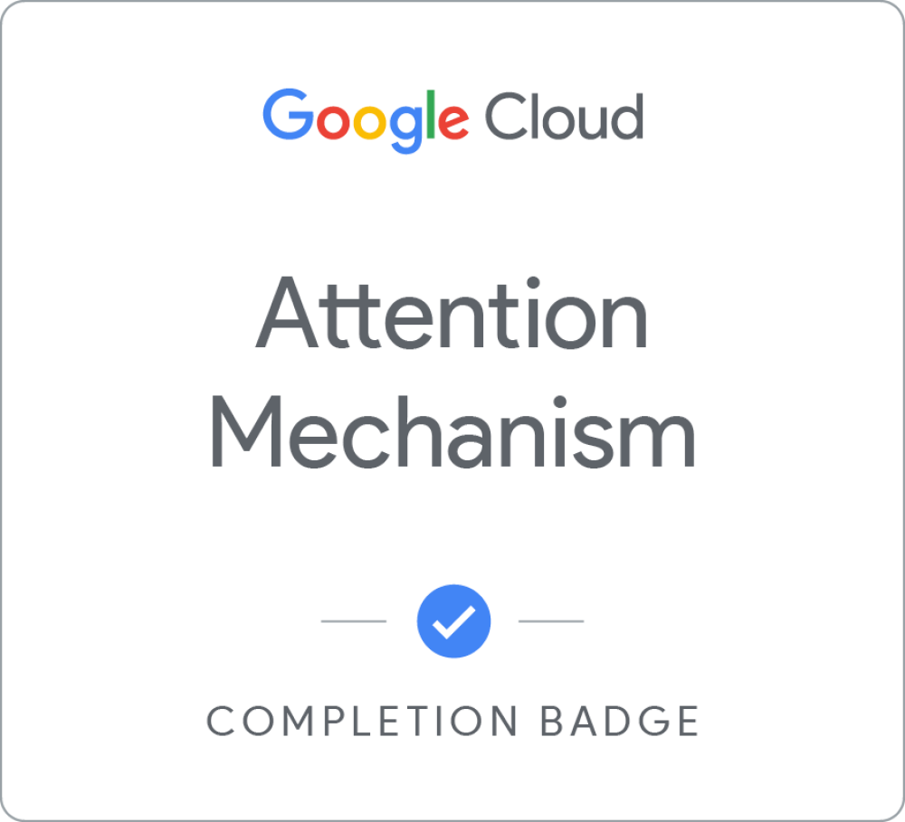

# My Badge Wall

### Hello 👋, I'm Enrique Gómez Tagle

<h4 align="center">
AWS Cloud AI & Data Lead - iOS Lab's Software Architect - App Development with Swift Associate (by Apple Inc.) - CEO at @kikinacademy 
  Data Intelligence &  Cybersecurity UP MX
</h4>

## About Me

As a leader in deploying innovative artificial intelligence and machine learning solutions, I specialize in cloud architecture and software development with AWS, ML & GenAI, and data engineering. As a AWS expert, I design scalable and secure infrastructures for AI applications, maximizing operational efficiency and technological innovation.

<!-- 🌐 Let's connect on [LinkedIn](https://www.linkedin.com/in/enriquegomeztagle/). -->

💡 I'm always on the lookout for collaborative projects that thrive on innovative ideas and creative solutions. Have an idea? Let's talk!

## My Badges

### Top Badges

<table align="center">
  <tr>
    <td align="center"> <a href="https://www.credly.com/badges/dcdd9edc-6597-4833-94fb-68c4c2f4ddaa/public_url">App Development with Swift Associate</a></td>
    <td align="center"> <a href="https://www.credly.com/badges/52eba041-4add-4a9f-b817-fcb54d364a1f/public_url">AWS Partner: Generative AI Essentials (Business)</a></td>
    <td align="center"> <a href="">Oracle Cloud Infraestructure Generative AI</a></td>
    <!-- Repeat <td> blocks for additional badges, up to 4 per row -->
  </tr>
</table>

### Oracle Cloud Infraestructure Certifications
<!-- <td align="center"> </td> -->
<table align="center">
  <tr>
    <td align="center"> <a href="">Oracle Cloud Infraestructure Generative AI</a</td>
    
  </tr>
</table>

### Google Developer Skills Boost Badges
<!-- <td align="center"> </td> -->
<table align="center">
  <tr>
    <td align="center"> <a href="https://www.cloudskillsboost.google/public_profiles/ab5a0a14-8f33-42ce-be80-2620aee93c16/badges/7876257">Responsible AI: Applying Principles</a></td>
    <td align="center"> <a href="https://www.cloudskillsboost.google/public_profiles/ab5a0a14-8f33-42ce-be80-2620aee93c16/badges/7876200">Generative AI Fundamentals</a></td>
    <td align="center"> <a href="https://www.cloudskillsboost.google/public_profiles/ab5a0a14-8f33-42ce-be80-2620aee93c16/badges/7876177">Introduction to Responsible AI</a></td>
    <td align="center"> <a href="https://www.cloudskillsboost.google/public_profiles/ab5a0a14-8f33-42ce-be80-2620aee93c16/badges/7876167">Introduction to Large Language Models</a></td>
  </tr>
  <tr>
    <td align="center"> <a href="https://www.cloudskillsboost.google/public_profiles/ab5a0a14-8f33-42ce-be80-2620aee93c16/badges/6816543">Introduction to Generative AI</a></td>
    <td align="center"> <a href="https://www.cloudskillsboost.google/public_profiles/ab5a0a14-8f33-42ce-be80-2620aee93c16/badges/9263117">Introduction to Gemini for Google Workspace</a></td>
    <td align="center"> <a href="https://www.cloudskillsboost.google/public_profiles/ab5a0a14-8f33-42ce-be80-2620aee93c16/badges/9263403">Gemini in Gmail</a></td>
    <td align="center"> <a href="https://www.cloudskillsboost.google/public_profiles/ab5a0a14-8f33-42ce-be80-2620aee93c16/badges/9326198">Gemini in Google Docs</a></td>
  </tr>
  <tr>
    <td align="center"> <a href="https://www.cloudskillsboost.google/public_profiles/ab5a0a14-8f33-42ce-be80-2620aee93c16/badges/9326238">Gemini in Google Slides</a></td>
    <td align="center"> <a href="https://www.cloudskillsboost.google/public_profiles/ab5a0a14-8f33-42ce-be80-2620aee93c16/badges/9326241">Gemini in Google Sheets</a></td>
    <td align="center"> <a href="https://www.cloudskillsboost.google/public_profiles/ab5a0a14-8f33-42ce-be80-2620aee93c16/badges/9326282">Gemini in Google Meet</a></td>
    <td align="center"> <a href="https://www.cloudskillsboost.google/public_profiles/ab5a0a14-8f33-42ce-be80-2620aee93c16/badges/9326515">Attention Mechanism</a></td> 
  </tr>
  
  <!-- Add more rows as necessary -->
</table>

### AWS Skill Builder Certificates

<table>
  <tr>
    <td></td>
    <td></td>
  </tr>

  <tr>
    <td></td>
    <td></td>
  </tr>

  <tr>
    <td></td>
    <td></td>
  </tr>

  <tr>
    <td></td>
    <td></td>
  </tr>
  
  <tr>
    <td></td>
    <td></td>
  </tr>

  <tr>
    <td></td>
    <td></td>
  </tr>

  <tr>
    <td>
    <td></td>
  </tr>

  <tr>
    <td></td>
    <td></td>
  </tr>

  <tr>
    <td></td>
    <td></td>
  </tr>
  <tr>
    <td></td>
    <td></td>
  </tr> 
  <!--  <tr>
    <td></td>
    <td></td>
  </tr>  -->
  
</table>

 <!-- https://www.credly.com/organizations/amazon-web-services/collections -->
